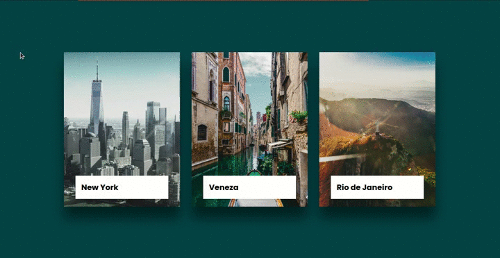

<h1 align="center">Card Cities</h1>

  
  

  Card Responsivos com imagem em background e descrição respectivo ao conteúdo principal.

 

  

    <a aria-label="Matheus" href="https://github.com/matheusmaximianomv">
      </img>
    </a>
  

## Apresentação

  

## Links das Aulas
* <a aria-label="Matheus" href="https://www.youtube.com/watch?v=9pXGz6Dv3q0">CSS Card Hover Effects | Html CSS | Part 1</a>
* <a aria-label="Matheus" href="https://www.youtube.com/watch?v=L4jbuKFJXaw">How To Make It Responsive | CSS Card Hover Effects | Html CSS Responsive Design | Part 2</a>

## Contribua com melhorias

1. Fork it (https://github.com/matheusmaximiano/Clone_UI/fork)
2. Crie uma branch de feature (git checkout -b feature/card_cities)
3. Commit suas alterações (git commit -m 'Tipo: Modificação')
4. Dê o push para a nova branch (git push origin feature/card_cities)
5. Crie uma nova Pull Request