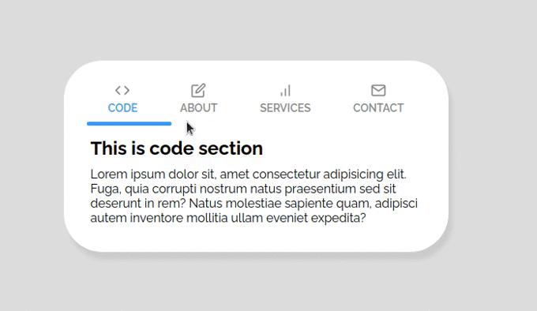

<h1 align="center">Indicator Tab Menu</h1>

  
  
  

  Simples Tab Menu com um indicador animado na troca dos conteúdos.

 

  

    <a aria-label="Matheus" href="https://github.com/matheusmaximianomv">
      </img>
    </a>
  

## Apresentação

  

## Links das Aulas
* <a aria-label="Matheus" href="https://www.youtube.com/watch?v=mBaMq1DphRs">How to Create Animated Tabs with Indicator using HTML, CSS & JavaScript</a>

## Contribua com melhorias

1. Fork it (https://github.com/matheusmaximiano/Clone_UI/fork)
2. Crie uma branch de feature (git checkout -b feature/indicator_tab_menu)
3. Commit suas alterações (git commit -m 'Tipo: Modificação')
4. Dê o push para a nova branch (git push origin feature/indicator_tab_menu)
5. Crie uma nova Pull Request